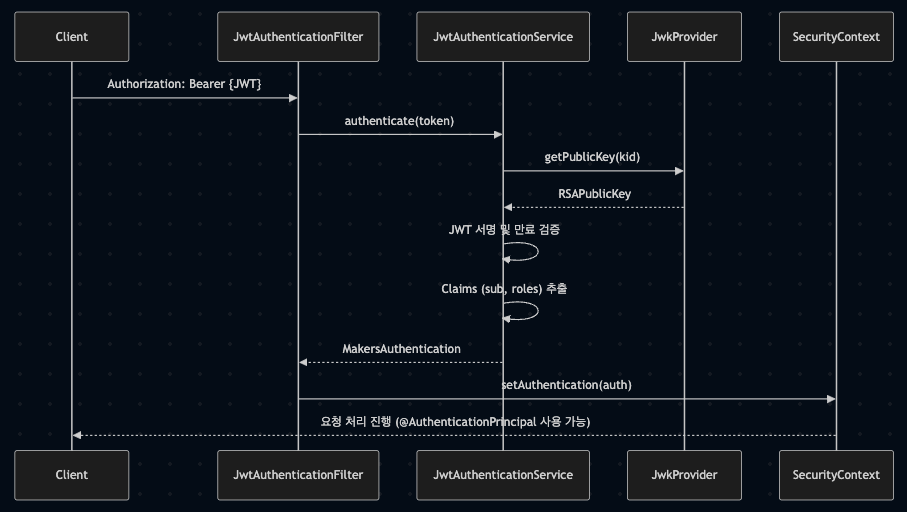

# 🔐 JWT JWK Verifier
> last update: 2025-05-12<br>
> author: 김성은 ([@sung-silver](https://github.com/sung-silver), SOPT makers platform team backend developer)

## summary

해당 프로젝트는 모든 서비스(playground, crew, admin, app)의 인증 로직을 공통화하기 위해 설계되었으며,
SOPT Makers 내 리소스 서버는 해당 프로젝트를 기반으로 JWT 인증을 처리해야 합니다.
각 서비스는 본 프로젝트를 참고하여 각 서비스의 인증 흐름에 맞게 통합하여 사용할 수 있습니다.

## intro

이 프로젝트는 [Makers 인증 서버](https://github.com/sopt-makers/sopt-auth-backend)와의 통신에 대한 가이드라인 프로젝트입니다.
JWT 토큰의 유효성을 검증하고, JWK를 사용하여 토큰의 서명을 검증하는 서비스를 제공합니다.
Spring Security와 Nimbus JOSE JWT 라이브러리를 사용하여 구현되었습니다.

## 가이드 프로젝트 기능

- JWT 토큰 검증
- JWK를 통한 토큰 서명 검증
- 토큰 캐싱 (Caffeine)
- Spring Security 통합
- RSA 키 기반 서명 검증
- SecurityContext 등록

## 기술 스택

- Java 17
- Spring Boot 3.4.4
- Spring Security
- Nimbus JOSE JWT 9.37.3
- Caffeine 3.1.8 (캐싱)
- Lombok

##  JWT / JWK 개요
### 🔐 JWT (JSON Web Token)
- 사용자 인증 정보를 인코딩한 토큰
- 세 부분으로 구성: header.payload.signature
- 클라이언트는 로그인 후 발급받은 JWT를 Authorization: Bearer {token} 형식으로 서버에 전달
- 서버는 이 토큰의 서명 검증과 만료 여부 확인을 통해 사용자를 인증

### 🔑 JWK (JSON Web Key)
- JWT의 서명을 검증하기 위한 공개키 집합 형식
- 인증 서버는 kid(Key ID)를 기준으로 특정 RSA 공개키를 JWK Set 형태로 제공합니다
- 리소스 서버(playground, crew, admin, app)는 이 JWK를 참조해 JWT 서명을 검증함으로써 인증 서버와의 신뢰 관계를 유지할 수 있습니다

> ✅ 이 프로젝트에서는 인증 서버가 발급한 JWT의 kid 값을 기반으로 해당 공개키를 가져와 JWT의 서명을 검증합니다. 공개키는 Caffeine으로 캐싱되어 성능을 보장하고, 실패 시 한 번 재시도합니다.

## 프로젝트 구조

```
📁 src/main/java/sopt/makers/jwt/verifier/
├── 📁 config/
│   └── SecurityConfig.java           # Spring Security 설정
├── 📁 external/
│   └── auth/
│       ├── AuthClientProperty.java   # Makers 인증 서버 설정
│       └── WebClientConfig.java      # WebClient 설정
├── 📁 jwt/
│   ├── 📁 config/
│   │   └── JwtRSAKeyConfiguration.java  # RSA 키 설정
│   ├── 📁 code/                         # JWT 관련 상수 및 에러 코드
│   ├── 📁 exception/                    # JWT 관련 예외 클래스
│   └── 📁 service/
│       ├── JwtAuthenticationService.java  # JWT 검증 서비스
│       └── JwkProvider.java          # JWK 관리 서비스
├── 📁 security/
│   ├── 📁 authentication/
│   │   └── MakersAuthentication.java # 인증 객체
│   └── 📁 filter/
│       ├── JwtAuthenticationFilter.java           # JWT 인증 필터
│       └── JwtAuthenticationExceptionFilter.java  # JWT 예외 처리 필터
└── 📁 controller/
    └── UserInfoController.java       # 사용자 정보 컨트롤러 (example)
```

## 주요 클래스 설명

### 🔐 JwtAuthenticationFilter
- 매 요청마다 Authorization 헤더의 JWT를 추출
- `JwtAuthenticationService`를 통해 토큰을 검증
- 검증된 사용자 정보를 `SecurityContextHolder`에 등록
- 인증 실패 시 예외를 `JwtAuthenticationExceptionFilter`에서 처리

### ⚠️ JwtAuthenticationExceptionFilter
- JWT 검증 도중 발생한 `JwtException`을 캐치
- 일관된 에러 응답(JSON) 형태로 반환

### 🔐 JwtAuthenticationService
- JWT 토큰을 파싱 및 검증하는 핵심 서비스
- `JwkProvider`를 호출해 `kid`에 해당하는 공개키를 조회
- JWT 클레임에서 `sub`, `roles` 등을 추출해 `MakersAuthentication` 객체로 반환

### 🔐 JwkProvider
- 인증 서버가 제공한 JWK Set을 Caffeine 캐시로 저장
- 주어진 `kid`에 해당하는 공개키를 반환
- 캐시된 키가 만료되었거나 서명 검증에 실패할 경우, 재요청 및 무효화 처리

### 🔐 MakersAuthentication
- 사용자 ID와 역할 정보를 담은 `Authentication` 구현체
- `SecurityContext`에 등록되는 인증 객체
- `@AuthenticationPrincipal`로 컨트롤러에서 바로 주입받아 사용 가능

### 🔐 SecurityConfig
- Spring Security 필터 체인을 정의
- `JwtAuthenticationFilter`와 `ExceptionFilter`를 수동으로 등록
- 모든 요청에 대해 인증 요구
- 세션 상태를 `STATELESS`로 설정

## 인증 서버 JWT 발급 방식
- RSA 키쌍 기반 서명 (`RS256`)
- `JwtClaimsSet`에 `sub`, `roles`, `exp`, `iss` 포함
- `JwsHeader`에 `alg`, `typ`, `kid` 포함
- 인증 서버에서 NimbusJwtEncoder를 통해 인코딩

## 리소스 서버(playground, crew, app, admin) 인증 흐름

1. 클라이언트가 `Authorization: Bearer {accessToken}` 헤더로 요청
2. JwtAuthenticationFilter가 토큰을 추출하고, JwtAuthenticationService를 통해 인증서버(JWK 서버)에서 공개키를 조회한 뒤 JWT의 서명을 검증하고 유효성을 확인
3. 유효한 토큰이면 `MakersAuthentication`을 생성하여 `SecurityContext`에 등록
4. 컨트롤러에서는 `@AuthenticationPrincipal`을 통해 인증 정보 접근 가능



## 가이드라인 프로젝트 시작하기

### 설치 및 실행

1. 프로젝트 클론
```bash
git clone [repository-url]
```

2. secret-application.properties 또는 .env 파일에 다음 내용 추가
> 각 팀별 세팅 값은 [백엔드 챕터 노션](https://www.notion.so/sopt-makers/1f176042aac280b3a5cfeeb5c4e8627d?pvs=4)에서 확인하실 수 있습니다
```bash
cd jwt.verifier/src/main/resources
vim application-secret.properties
```

```bash
MAKERS_AUTH_JWK_ENDPOINT={공개키 조회 경로}
MAKERS_AUTH_JWK_ISSUER={인증 서버 이름}

AUTH_API_KEY={각 팀 API 키}
OUR_SERVICE_NAME={각 팀 서비스 이름}
```

3. 프로젝트 루트 디렉토리로 이동
```bash
cd ../../../
```

4. 프로젝트 빌드
```bash
./gradlew build
```

5. 애플리케이션 실행
```bash
./gradlew bootRun
```

### 사용자 인증 응답 예시
- 요청: GET /me
```json
{
  "success": true,
  "message": "유저 정보 조회에 성공했습니다",
  "data": {
    "userId": "6",
    "roles": [
      "MEMBER"
    ]
  }
}
```